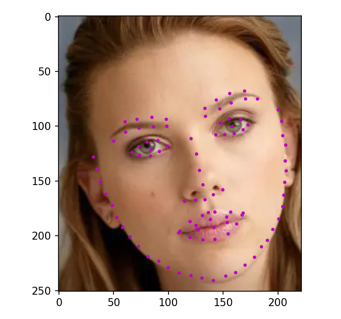

# 人脸关键点检测PFLD算法——Tensorflow2实现


## 1. 环境配置

- tensorflow-gpu==2.4.0
- opencv-python==4.5.5.62
- numpy==1.19.5
- Pillow==8.4.0
- tensorboard==2.7.0

## 2. 数据准备和处理

地址：https://wywu.github.io/projects/LAB/WFLW.html
或者百度网盘：
链接：https://pan.baidu.com/s/1CyMGCIX_3m2W1kdk7oOcFA 
提取码：fh3e 

数据文件夹格式如下：
```python
- WFLW
	- WFLW_annotations
		- list_98pt_rect_attr_train_test  
			- list_98pt_rect_attr_test.txt
			- list_98pt_rect_attr_train.txt
		- list_98pt_test # 略
		- Mirror98.txt
	- WFLW_images
		- 0--Parade
		- 1--Handshaking
		- ...
```
在准备好之后，运行txt_annotation.py文件会得到两个文件夹，test_data、train_data，里面存放着需要训练的数据。

## 3. 训练步骤

在train.py文件中，参数设置如下：
```python
# -------------------------------- #
# batch_size -> 批次
# epochs -> 轮次
# model_path -> 预训练权重路径 
# input_shape -> 输入图片大小
# lr -> 学习率
# -------------------------------- #
batch_size = 32
epochs = 100
model_path = ''
input_shape = [112,112,3]
lr=1e-3
```

训练结束后可以使用如下命令查看训练过程可视化的参数：
```txt
tensorboard --logdir=path_to_your_logs(就是本项目的logs1文件夹)
```

## 4. 预测步骤
1. 首先在PDLD.py文件中，指定好参数，权重文件在model_data文件夹中
2. 运行在predict.py即可，如img/1.png
效果如下：



## 5. 参考

[https://github.com/polarisZhao/PFLD-pytorch](https://github.com/polarisZhao/PFLD-pytorch)
